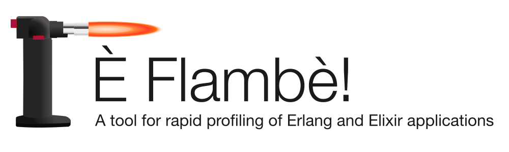
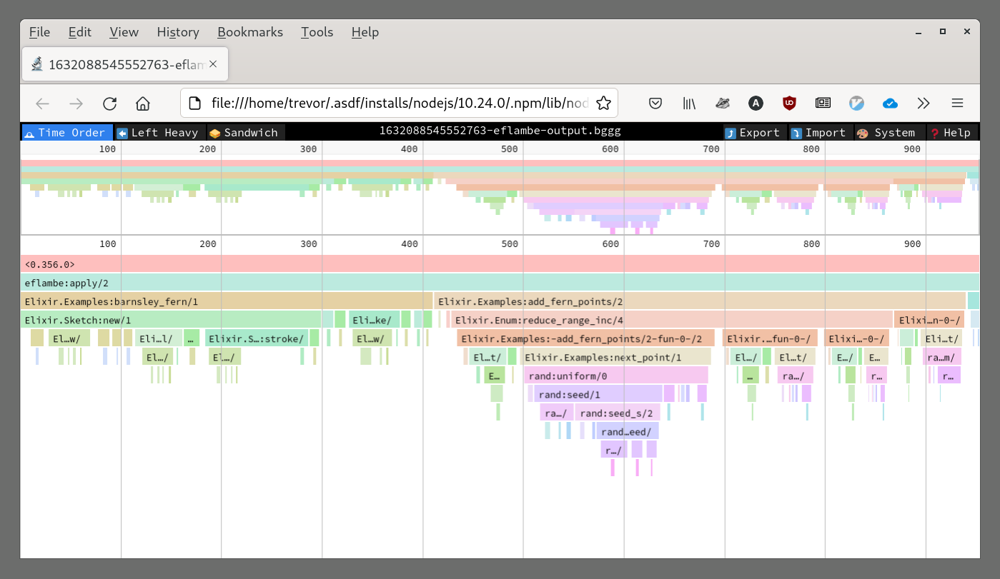
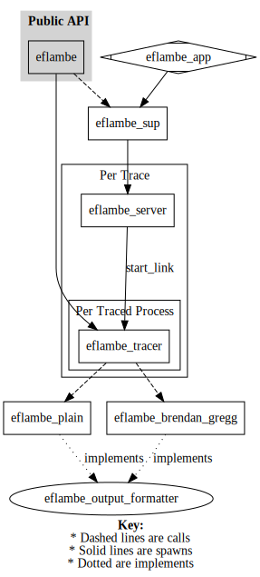

* Designed for rapid generation of flamegraphs - no need to edit source code or recompile!
* Generates output in several common formats - perf and Brendan Gregg's
* Interface inspired by recon_trace to automatically stop flamegraph generation
* Can automatically open data in your flamegraph viewer of choice

== Output Viewed in Speedscope

link:https://youtu.be/fRNdej-UXKQ[Watch a quick demo here]

== Description

This tool is designed to be the first profiling tool you reach for during development. It is designed for rapid visualization of program execution. It generates one or more flamegraphs of any function you specify. You can easily select function(s) to profile in the shell without having to alter your code or restart your application. This tool has two distinct advantages over existing flamegraph generators in Erlang:

* It doesn't require the user to insert profiling code into the functions they want to visualize as flamegraphs. Everything can be done on the fly without restarting your application.
* It generates output in formats used by most flamegraph viewers. No manual post-processing is needed.
* No Perl code.

== Installation

=== Elixir

Add the following line to your `mix.exs` file and then run `mix deps.get`:

[source, elixir]
----
{:eflambe, "~> 0.2.4"}
----

=== Erlang

Add the following line to your `rebar.config` file and then run `rebar3 get-deps`:

[source, erlang]
----
{eflambe, "0.2.4"}
----

== Usage

There are two ways to profile code with eflambè. You can either invoke the code directly using `eflambe:apply/1,2` or you can "capture" trace data from a function when it is invoked while your application is running with `eflambe:capture/1,2,3`.

=== `eflambe:capture/3`

This is useful when you want to profile a function as it is invoked normally inside of an application.

[source, erlang]
----
eflambe:capture({Module :: atom(), Function :: atom(), Arity :: integer}, NumberOfCallsToProfile integer(), Options :: list()).
----

Example:

[source, erlang]
----
1> eflambe:capture({lists, seq, [1, 10]}, 1, [{output_format, brendan_gregg}]).
% Wait for program to invoke `lists:seq/2`
----

=== `eflambe:apply/2`

For profiling a function that you want to invoke directly.

[source, erlang]
----
eflambe:apply({Module :: atom(), Function :: atom(), Args :: list()}, Options :: list()).
eflambe:apply(Fun :: fun(), Options :: list()).
----

Example:

[source, erlang]
----
1> eflambe:apply({module, fun, Args}, [{output_format, brendan_gregg}]).
ok
----

=== Options

* `{output_directory, Dir}` - Specify the output directory to write trace data to. Default is project root, and relative paths are relative to the project root.
* `{output_format, Format}` - Specify the output format. Unfortunately I was not able to implement all the formatters I would have liked to during Spawnfest. Currently only the `brendan_gregg` formatter is available. +++<del>+++`Format` must be one of `perf`, `brendan_gregg`, or `svg`. Default is `brendan_gregg`.+++</del>+++
* `{open, Program}` - Specify the program to load the trace output in after output is generated. `Program` must be one of `speedscope` or `hotspot`. By default this option is not set. `hotspot` is not useful right now as it cannot load files generated by the `brendan_gregg` formatter.

== Implementation

While designing this tool there were several different approaches I considered. Because I wanted the user to be able to dynamically select functions to profile at runtime, I'd need to start tracing any process that invoked the selected function. Unfortunately it's hard to turn tracing on at an exact point in time for a specific process. All the existing tracing libraries do not support this. An ideal implementation would have been an `erl_tracer` behavior that blocked execution when the selected function was invoked for just long enough to start a trace of all the internal function calls. But unfortunately this wasn't possible due to the fact that `erl_tracer` callbacks must be NIFs and NIFs cannot call Erlang functions directly. There are some hacky ways to get around this, but it didn't feel like a good solution.

The solution I settled on is unfortunately no less hacky but is a bit more straightforward. Instead of trying to halt execution at a specific point in time, we use meck to create a mock of the module containing the function the user wants to profile with the passthrough option enabled. This results in a new module that is an exact copy, but it allows us to wrap the function the user specified in eflambe profiling code. Once profiling is complete the mock is removed and the original module is restored. The downside to this is that we've injected code into the module the user wants profiled, so the data collected doesn't provide an accurate picture of the performance of the function itself. It should however provide a fairly accurate picture of the performance of all the code inside the function.

Heavily inspired by:

* https://github.com/proger/eflame
* https://github.com/ebegumisa/flame_prof

=== Architecture Diagram

== Contributing

Feedback is welcome! This was started as a hackathon project but I plan on maintaining it for my teams every day use, so if you see something that could be improved please open an issue!

==== Tagging Releases

1. Update versions in `README.adoc` and `CITATION.cff` to new version.
1. Run `git add README.adoc CITATION.cff`.
1. Use `rebar3 hex cut` and type `Y` when asked to create a commit.
1. Run `git tag <new tag>`.
1. Run `git push origin master <new tag>`.
